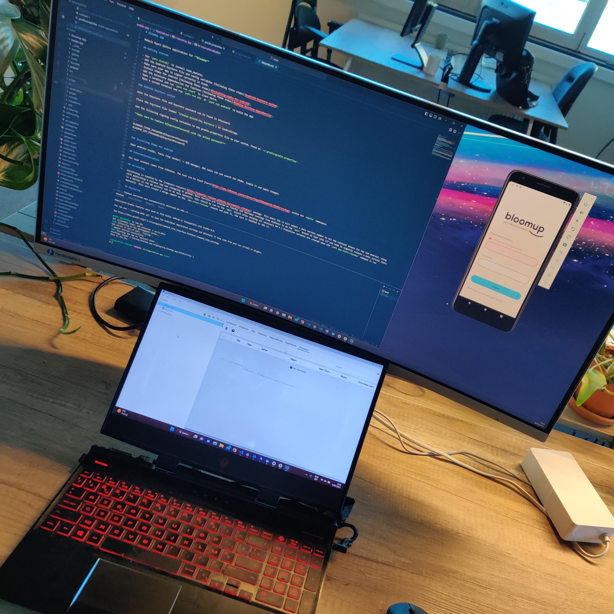

# Update 2 weken verder

Ondertussen zijn we (bijna) 2 weken verder dus misschien is het tijd om een update te maken? ;)

## Huidige opdracht

Momenteel ben ik mezelf aan het verdiepen in de documentatie van Prisma.io, wat een ORM is.
Mijn opdracht was om ervoor te zorgen dat users met consultaties die reeds gebeurd waren en nog niet betaald zijn geen nieuwe consultaties kunnen aanmaken. Hiervoor moest ik mezelf uiteraard gaan verdiepen in de manier waarop alle data gecommuniceerd wordt met de API aangezien ik server-side een error zou moeten gooien hiervoor.

## Wat voorbij is

Nu hebben jullie al een update gehad over waar ik momenteel mee bezig ben, maar waarschijnlijk hebben jullie nog geen idee over waarmee ik me afgelopen week heb bezig gehouden. 

## Quote of the day
>"No money, no honey"

## Drie taken

Momenteel ben ik aan een nieuwe feature bezig wat ervoor zou gaan zorgen dat gebruikers die hun voorbije consultaties niet betaald hebben minder en minder functionaliteiten krijgen binnen de app. Deel 1 hiervan was ervoor zorgen dat users geen consultaties kunnen joinen als ze deze nog niet betaald hebben, deel 2 was de consultaties die nog niet betaald zijn met een andere opmaak tonen en over deel 3 weten jullie ondertussen hopelijk al meer :).