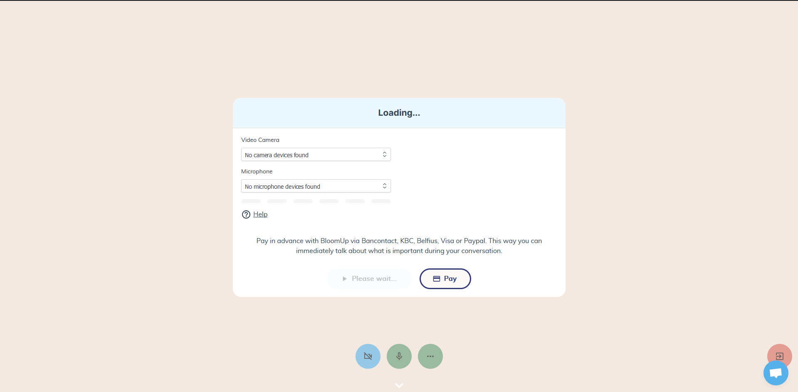

# Update 3de week

De 3de stageweek was voor mij persoonlijk tot nu toe de minst aangename doordat ik een aantal tegenslagen heb mogen ervaren.

## Maandag 20 Februari

Mijn PR die op vrijdagnamiddag gemerged was, die ervoor zou zorgen dat klanten niet in hun video call konden zolang de consultatie niet betaald was bleek toch niet zo waterdicht te zijn als ik gedacht had. 
Doordat ik niet wist dat er aan 'intro' consultaties geen cashtransactie gekoppeld werd, had ik onbedoeld alle intro consultaties gebroken. Dit doordat ik een conditional render deed afhankelijk van de transactie, die de video call UI moest tonen.
Wat er dus uiteindelijk in resulteerde dat er bij intro consultaties enkel een wit scherm getoond werd. 
Gelukkig heeft het development team de commit snel kunnen reverten en mocht ik deel uitmaken van de post-mortem meeting op dinsdag.

## Donderdag 23 Februari

Donderdag tijdens de refinement meeting kwam het volgende probleem, ik had zonet mijn PR gemerged die ervoor zou zorgen dat de klant geen nieuwe consultaties kan boeken zolang er oude consultaties nog openstaande betalingen hebben.
Ikzelf had dit zorgvuldig getest en ervoor gezorgd dat alles werkte zoals ik het voor ogen had, jammer genoeg was ik er niet van op de hoogte dat professionals ook afspraken kunnen maken.
Wat erin resulteerde dat de API gewoon de juiste error op de juiste moment gooide, maar dat deze niet was afgehandeld in de front-end langs de kant van de professionals en zij dus een generieke error message kregen.
Gelukkig wist ik direct waar het probleem ging zitten en was het dus snel op te lossen.
Hierna zat de moed me wel wat 'in de schoenen' maar uiteindelijk heb ik me er vrijdag best snel over kunnen zetten en gewoon door kunnen gaan met bijleren :).