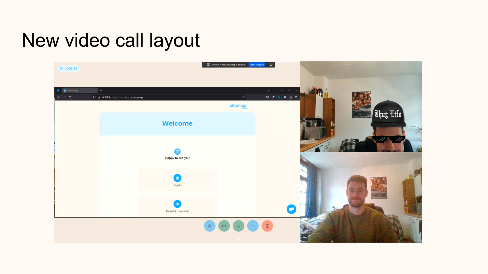

## Coding

Week 12 heb ik verder gespendeerd aan de AWS chime improvements die vorige week al besproken werden :).

## Company update

Wat wél voor de eerste keer gebeurde tijdens week 12 was een company update. Vooraf hadden we wel al de 2-wekelijkse review meetings waar product (waar wij als engineering onder vallen) demo's gaf en toonde wat er de afgelopen weken aan de applicatie veranderd was.
Het grote verschil met de company update is dat vanaf nu iedereen een korte presentatie zou geven over wat hij/zij de afgelopen maand verwezenlijkt heeft.

Aangezien Clovis gevraagd had voor leuke & interactieve slides voelde wij als team engineering aan dat dit ons moment was om te 'shinen'.
Zelfs na het indienen van de slides voegde Vincent nog stiekeme toevoegingen toe aan mijn slides die ik pas tijdens de presentatie zelf ontdekte achteraf. Hieronder zal ik een screenshot plaatsen van de presentatie zodat ullie de 2 attributen in kwestie kunnen zoeken.

Maar wat ik persoonlijk het leukst vond aan de company update was dat iedereen op deze vrijdag op locatie was komen werken zodat we tijdens deze meeting ook een beetje zouden kunnnen 'vieren' wat iedereen de afgelopen maand gedaan heeft, waar natuurlijk een klein feestje bij kwam kijken achteraf.
Aangezien ik toevallig mijn gitaar bij had zodat ik na de festiviteiten direct door kon gaan naar het station en niet meer langst mijn kot moest vonden de collega's het uiteraard vanzelfsprekend dat ik een 'kampvuurkaraoke' zou organiseren.
Initiëel vond ik dat natuurlijk een beetje ongemakkelijk, maar al snel veranderde dat gevoel naar iets fijner en heb ik iedereen toch weer een beetje langst een andere kant leren kennen.
