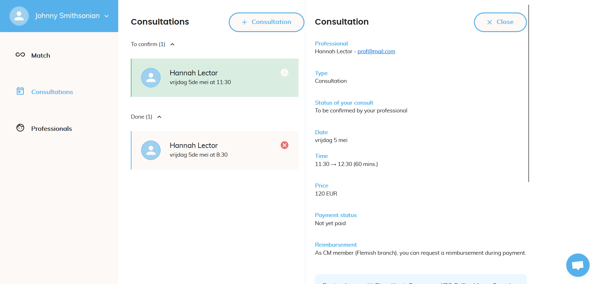

Week 13 gaat een beetje minder exciting zijn aangezien er niet bepaald iets speciaals gebeurd is.

## Coding

### Translate timestamp when booking

Een paar weken terug had ik opgemerkt dat bepaalde timestamps niet getranslate werden in het bookingscherm.
Dit was opzich wel een leuke issue omdat ik hierbij veel heb bijgeleerd over het formatteren van dates in typescript.

### Remove adress step

Na de intro consultaties te breken voor nieuwe users met deze PR een paar weken geleden heb ik vrijdag dan toch eindelijk de juiste changes kunnen pushen.
De verschillen met de vorige PR waren dat deze veel grondiger was in data verwijderen die overtollig zou worden alsook dat de redirects hier wel correct zouden gebeuren.
Vroeger werd er een variabele aangepast via een useEffect die zou gaan aangeven wanneer het tijd was om de consultatie te schedulen, wat bij nader inzien een compleet verkeerde manier van werken is.
Uiteindelijk heb ik dan zelf een nieuwe, betere mutatie geschreven en deze ook op het correcte moment aangeroepen in plaats van alles te monitoren door een useEffect want daarvoor zijn useEffects niet in het leven geroepen.

### Save invited email in lowercase

Deze issue hield in dat users die geïnvite werden niet altijd konden inloggen omdat de email niet in lowercase bijgehouden werd, waarvan onze ganse applicatie wel uit gaat.
Natuurlijk ben ik hier niet bepaald lang aan bezig geweest aangezien het letterlijk enkel een toLowerCase functie toevoegen was, maar het hoeft ook niet altijd moeilijk te zijn :).
