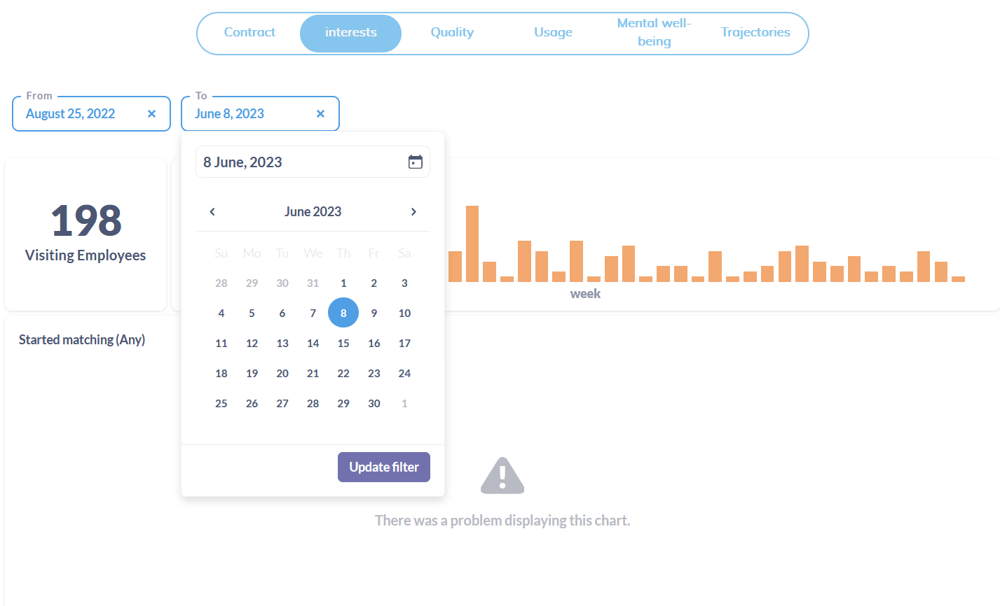
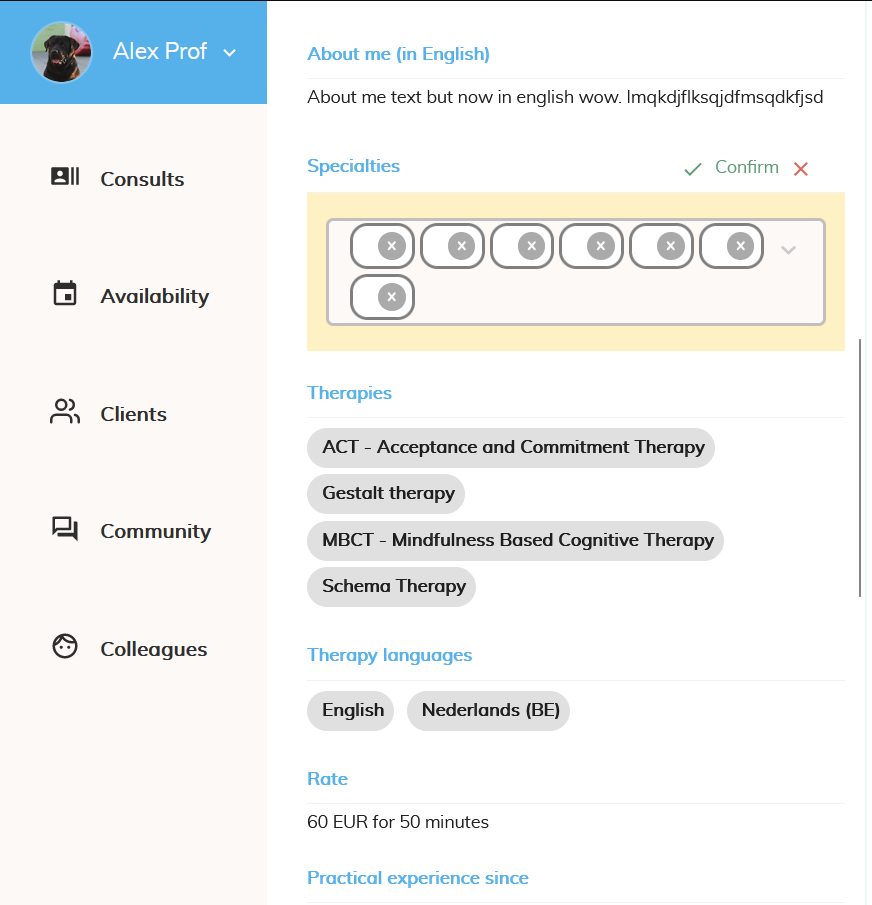

## Coding

Tijdens deze week heb ik aan een aantal kleinere issues mogen werken, wat voor mij best 'refreshing' aanvoelde aangezien ik de laatste tijd vaak op eenzelfde issue had gezeten voor langere termijn.

### Default dates on dashboards

Hoe het vooraf gebeurde in de in-app dashboards was dat de default enddate hardcoded op maximum de huidige dag stond en dat er achter de schermen een startdate werd gezet die een jaar terugtelde vanaf de huidige datum, aangezien dit nergens vermeld werd was het best vaag.
Mijn taak was om die startdate dus duidelijk te maken in de app zelf en te laten afhangen van de startdatum van het contract van het betreffende bedrijf (aangezien we die sinds recent bijhielden).
Na veel zoeken in de metabase (dashboarding tool) docs bleek het dat er default parameters mee konden gegeven worden via de URL van de Iframe waarin de dashboards gerenderd worden.
Initieel ben ik nog even aan het strugglen geweest met het feit dat de date's goed doorkwamen maar niet aanpasbaar meer waren maar dat was snel opgelost.
Verder heb ik ook ontdekt dat voor het testen hiervan en vooral het ontdekken van welke URL er nu eigenlijk gecalled werd de network tab in de browser heel handig kan zijn om requests te bekijken.

### Empty match list issue

Woensdag tijdens lunch kwam Vincent me plots vragen of ik even met hem mee kon komen, wat uiteindelijk bleek te zijn omdat we een issue hadden in de app.
Al een geluk hadden we snel door dat de issue in kwestie veroorzaakt werd doordat de organisatie die het ticket had aangemaakt geen 'numberOfFreeConsults' waarde had, waar de render van het component met de matches afhankelijk van was.
Initieel hebben we dit snel even opgelost door de organisatie een waarde te geven in de database omdat het daarmee opgelost was.
Later op de dag heb ik dan even verder de tijd genomen om de issue te bekijken, bevestigd dat dat hetgene was wat misging en de conditional render uit de code gehaald om zo de issue voorgoed te fixen.

### Discarding breaks specialties

Zoals op de foto hieronder te zien verdwenen de labels van de specialties wanneer je tijdens een edit van de specialties je wijzigingen discardde.

Dit kwam doordat in de onDiscard functie de potentiëel aangepaste array compleet verkeerd ingeladen werd, misschien gaat dit ooit zo gewerkt hebben maar nu was het alleszins compleet verkeerd.

## Stagebeurs

Aangezien Clovis het tijdens deze periode best druk had, had Pieter me gevraagd of ik dit jaar graag mee naar de stagebeurs van onze school ging om nieuwe stagaires te zoeken voor het komende jaar.
Zelf vond ik het natuurlijk super leuk om hiermee naartoe gevraagd te worden, in mijn ogen toonde dit wel dat ze mij vertrouwen en waarderen dus dat voelde best fijn.
Verder was het natuurlijk heel mooi meegenomen aangezien ik in geuren en kleuren kon uitleggen hoe mooi de stage aansluit bij de opleiding naar mijn ervaring.
Daarnaast was het ook wel eens leuk dat de dag er gewoon eens anders uitzag dan normaal.

## Shareholders

Woensdagavond was er een shareholder meeting waarvoor Clovis eerder al een poll had gedaan of het ons misschien leuk leek om eens te interacten met de aandeelhouders en ideeën uit te wisselen.
Uiteraard heb ik mezelf hiervoor aangeboden en na een leuke lunch gevolgd door enkele partygames terwijl de aandelhouders gebrieft werden over de financiën kregen ze dan nog een uurtje om aan standjes ingedeeld per onderwerp te komen praten met de werknemers.
Ik had mezelf samen met Pieter en Vincent bij het standje over A.I. gezet en heb zo uiteindelijk nog wel interessante conversaties mogen bijwonen.

## Aanbod

Ten slotte was het hoogtepunt van deze week toch wel dat ik woensdagmiddag een meeting had met Pieter en Clovis waarin ze mij een jobaanbod hebben gedaan waar ik natuurlijk enorm graag op inging :).
