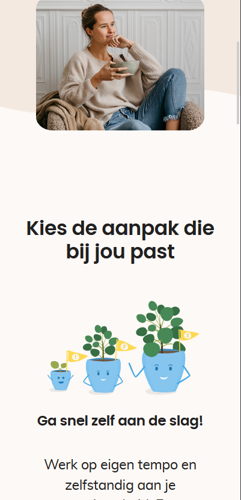

# Week 4

## Maandag 27/04

Deze maandag was ik weer thuis aan het werken aangezien ik in de avond nog naar de tandarts moest en mezelf zo sneller kon verplaatsen.
Jammer genoeg was dit achteraf gezien overbodig aangezien de tandarts de afspraak moest verplaatsen door persoonlijke redenen.
Tijdens de dag zelf heb ik verder gewerkt aan mijn ge-revertte feature dat de videocalls moest blokkeren. Verder deed ik nog wat improvements aan de responsiveness van de GGT landingpagina.

## Dinsdag 28/04

Dinsdag zijn er nog een aantal features live gegaan waar ik in de vorige week en maandag aan gewerkt had, bv. het toevoegen van de support email aan de 404 pagina.
Dit was voortgekomen uit een eerdere post-mortem meeting waar de app volledig niet werkte door een dependency issue en support dus ook niet gecontacteerd kon worden.
De feature i.v.m. de onbetaalde videocalls ging dinsdag ook live in de finale versie :).
Verder werkte ik ook nog aan het afhandelen van de API error die ik vorige week schreef. 

## Woensdag en Donderdag

Ik ga deze dagen even samen bespreken aangezien ik tijdens deze 2 dagen eigenlijk vooral kleine styling updates en bugfixes gedaan heb tijdens deze dagen.
Hieronder een aantal screenshots van het uiteindelijke resultaat :).

Bij beide pagina's heb ik wat met de margin en padding aan het spelen geweest, bij de laatste screenshot heb ik ook uitgezocht hoe ik de string kon gaan afcutten als hij er niet op zou passen.

## Vrijdag 3/03

Vrijdag heb ik mezelf verdiept in de [prisma docs](https://www.prisma.io/docs) aangezien ik een ticketje had opgenomen wat inhield dat er een kolom verdwijderd moest worden uit de API en DB wat niet meer gebruikt werd.
