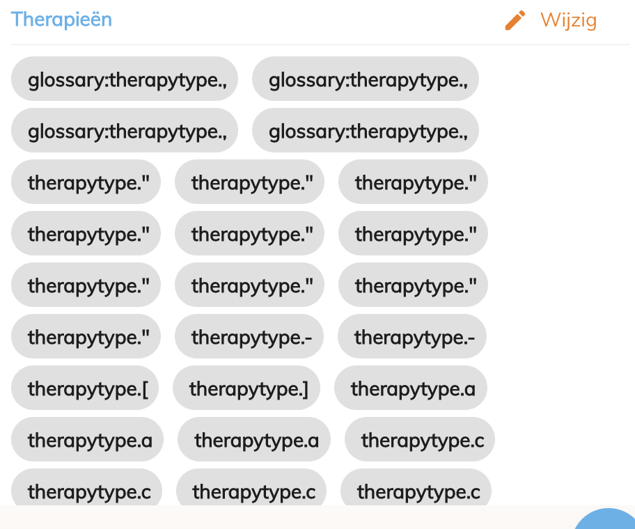
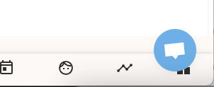

# Week 6

Deze week ben ik vooral bezig geweest met het uitzoeken van een bug die ervoor zorgde dat wanneer een professional zijn/haar therapy types wou aanpassen de labels verkeerd gerenderd werden.
Raar genoeg was deze bug wel telkens opgelost bij het refreshen van de pagina.

Aangezien ik de absolute meerderheid van de dagen deze week heb gespendeerd aan het graven in de code en uitzoeken waar de bug misschien aan zou liggen denk ik dat het niet zozeer nuttig is om alle dagen apart te behandelen.

Al snel had ik gevonden dat het aan het feit lag dat na het opslaan van het formulier de therapy types binnenkwamen als een stringified array, wat er dan uiteindelijk in zou resulteren dat de for loop (die normaal over de array loopt) de string zelf als array zou zien en dus voor elk karakter een aparte chip zou aanmaken.
Ik heb verschillende flows van de app gecontroleerd waar de labels potentiëel fout konden gerenderd worden zoals hoe de values naar de API gestuurd worden, hoe ze vertaald worden, hoe ze uit de API gehaald worden enzovoort.

Uiteindelijk bleek het te gaan om een heel 'nasty' stukje code dat een lokale state bijhield van de types. Wat deze manier van werken moeilijk maakt is dat je deze state natuurlijk ten allen tijde in sync moet houden met de waarde in de API, wat op zichzelf al geen goed recept is voor succes.
Bij de code die 'on update' uitgevoerd werd zat er dus zo'n foutje in dat ervoor zorgde dat de 'stringified' array (die zo wordt opgeslagen in de API) ook in de state werd aangepast. 

De oplossing was dan ook niet moeilijk, er terug voor zorgen dat de overtollige state uit het systeem gehaald wordt en dat de waarde dus altijd uit de API wordt gehaald.
Initiëel lijkt dit misschien een beetje omslachtig om elke keer een API call te maken, maar Louis wist me te vertellen dat Apollo gewoon query's cached die in gebruik zijn en dat dit dus helemaal geen issue is voor performance.

Dus ja, maandag dinsdag en donderdag (want woensdag hadden we jobbeurs) heb ik me vooral bezig gehouden met het zoeken van het probleem om het dan uiteindelijk donderdagmiddag te vinden. Vrijdag ging ik van start met uit te zoeken hoe Crisp geïmplementeerd is in de app om ervoor te zorgen dat de tooltip niet langer over de main menu getoond wordt op mobile maar meer hierover volgende week :).

