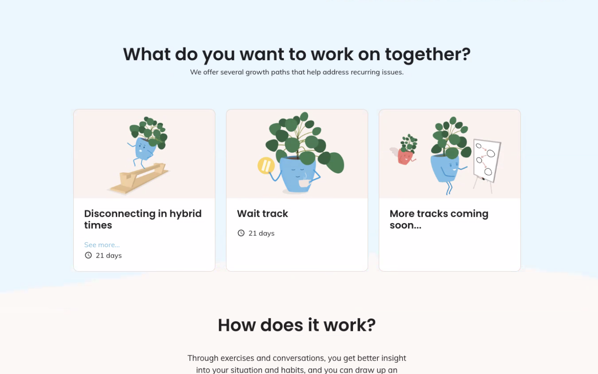
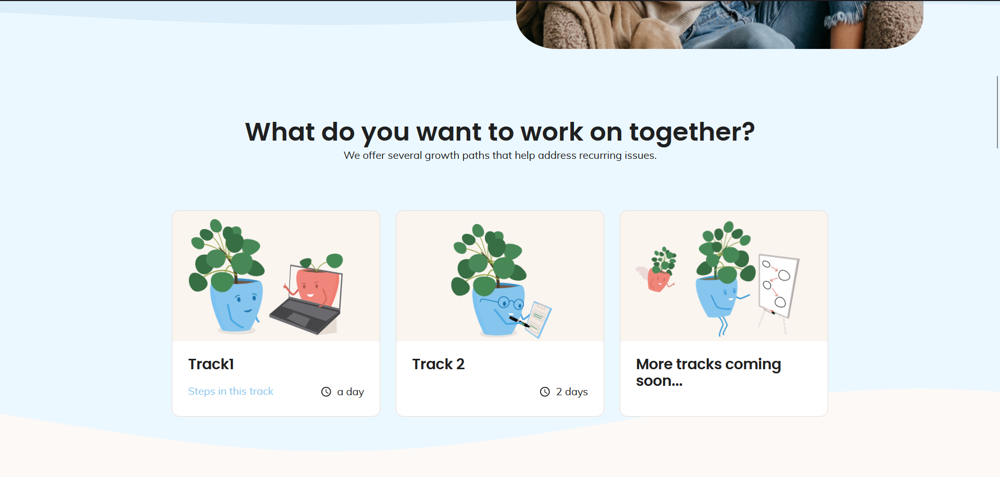

# Week 7

## Maandag 20/03

Deze maandag begon ik met het mergen van mijn PR over de labels die verkeerd gerenderd werden aangezien ik niet zo fan was van het mergen van een update van een resolver op vrijdagavond.

Verder ben ik begonnen aan een layout update van de kaartjes op de landingpage van ggt. 
Ik zal hieronder even de oude layout naast de nieuwe zetten.

## Dinsdag 21/03

Dinsdag heb ik gewerkt aan een SQL-query om oude data te migreren. De link tussen ggt prof's en een traject van een persoon wordt nu specifiek bijgehouden terwijl het vroeger afhing van een query naar checkin consultaties, om deze data uniform te maken moest ik de oude resolvers verwijderen en ervoor zorgen dat de nieuwe kolom dus ook data kreeg afhankelijk van een eenmalige query naar de oudere gegevens.
Het was nog wel eens interessant om een beetje SQL te schrijven aangezien het alweer even geleden was dat ik dat gedaan had.

## Woensdag 22/03 

Woensdag heb ik een bug opgelost die ik zelf gereport had, namelijk het feit dat de settings van de videocall niet meer werkten langs clientside. Gelukkig was dit snel opgelost door gewoon een component terug correct te renderen dat ik perongeluk in een vorige commit i.v.m. de unpaid consults had aangepast.
Daarnaast heb ik ook nog even een waarde aangepast waarvan ik de berekening in mijn commit rond het wrappen van de matched chips verkeerd heb gemaakt. Aangezien ik toch in deze file aan het werken was heb ik dan ook nog wat code netter gemaakt i.v.m. de translations die daar gedaan werden.

## Donderdag 23/03

Donderdag ben ik aan een nieuwe bug begonnen die inhoud dat in de matching de labels niet mee van taal veranderen. Al snel kwam ik erachter dat het ligt aan het feit dat de waardes te vroeg in de code vertaald worden, na kort te overleggen met de teamleden beslisten we samen dat het interessant zou zijn als ik dus helemaal zou herwerken hoe de vertalingen van formulieren werken. 

## Vrijdag 24/03

Vrijdag heb ik nog verder gewerkt aan het herstructureren van de vertalingen, wat uiteindelijk toch best pittig bleek te zijn aangezien deze code op heel veel plaatsen in de app gebruikt wordt. In de namiddag had ik nog een meeting om te refinen hoe we de nieuwe GGT track aan gaan pakken en dit ook meteen allemaal in ticketjes op te splitsen. Daarna was er ook nog de 2-wekelijkse demo van product waar ik deze week niets moest voorstellen aangezien ik vooral kleine bugfixes gedaan had. 
